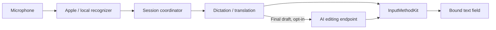

<p align="center">
  
</p>

<h1 align="center">Saylane</h1>

<p align="center">
  <strong>Speak naturally. Write in the language you need.</strong><br />
  A native macOS input method for Pinyin, voice dictation, and translation directly into your text field.
</p>

<p align="center">
  <a href="https://github.com/LiuTianjie/Saylane/releases/latest"></a>
  <a href="project.yml"></a>
  <a href="project.yml"></a>
</p>

<p align="center">
  <a href="https://github.com/LiuTianjie/Saylane/releases/latest">Download</a> ·
  <a href="https://liutianjie.github.io/Saylane/">Website &amp; interactive demo</a> ·
  <a href="docs/安装说明.md">Installation guide</a> ·
  <a href="#build-from-source">Development</a> ·
  <a href="README.zh-CN.md">简体中文</a>
</p>

<p align="center">
  <br />
  <sub>Hold to speak. Release to commit. Stay in the app you're using.</sub>
</p>

---

Saylane is a macOS input method plus a small background program: the input method types and writes into the focused field, the program does dictation, translation, screen translation and settings. Type Chinese with Rime-backed Pinyin, hold a key to dictate, or speak in one language and write in another. Text appears as editable composition in the focused field, then commits when you finish.

**The default path uses Apple's on-device speech recognition and translation.** Downloadable local recognizers are available, and AI editing is an optional final step using an endpoint you configure. Ordinary dictation and translation need no model API key.

For example, with Chinese → English selected:

> **You say:** 把会议改到明天下午三点。<br />
> **You write:** Move the meeting to 3 p.m. tomorrow.

*Illustrative output; wording depends on the recognizer and translation model.*

## Built around the text field

- **Keep typing and speaking in one input method.** Rime handles Pinyin composition, candidate selection, mixed English, and user vocabulary learning. Voice input uses the same native text-input connection.
- **See a draft while you speak.** Recognition and translation update the current composition. Releasing the shortcut finalizes and commits once; `Esc` cancels the session.
- **Choose dictation or translation.** Configure a language pair and switch between A → A, A → B, B → A, and B → B. Same-language dictation skips translation.
- **Choose your local recognizer.** Start with Apple, or download Qwen3-ASR, SenseVoiceSmall, or Fun-ASR-Nano from Settings.
- **Separate previews from final editing.** Local cleanup and terminology corrections run at the final stage. Optional AI editing can refine the finished draft without processing every partial result.
- **Read text on screen, too.** Capture a region and view translated text over the pinned screenshot, using local Vision OCR and Apple Translation.

When the focused field has attached an input-method client, text is composed and committed through **InputMethodKit**. Under another input source, or in applications that never attach a client (terminals, some Electron apps), the finished text is pasted at the caret and the previous clipboard contents are restored; this route needs the **Accessibility** permission, and without it the text stays on the clipboard.

## Get started

### 1. Install and enable Saylane

You need **macOS 26+ on Apple Silicon**. Intel Macs and older macOS versions are not supported by the current build.

Download the `.pkg` and `SHA256SUMS.txt` from [GitHub Releases](https://github.com/LiuTianjie/Saylane/releases/latest). The installer places two programs:

```text
/Library/Input Methods/Saylane.app    the input method
/Applications/Saylane.app             the main program (since 0.3; no Dock icon, started by the input method when needed)
```

> **Distribution status:** the [v0.2.75 release](https://github.com/LiuTianjie/Saylane/releases/tag/v0.2.75) contains an app signed with Developer ID Application. Its PKG installer is unsigned and has not been notarized by Apple. See the [installation guide](docs/安装说明.md) for the current installation requirements.

After the installation Saylane adds itself to the input sources and switches to itself; no trip to System Settings. The welcome page that follows is a single screen: a practice field and three status rows. macOS asks about the microphone the first time you hold the key to talk; Accessibility is optional.

### 2. Speak into a text field

1. Focus a compatible text field and select **Saylane** as the input source.
2. Check the speaking and output languages; the default is **Simplified Chinese → English**.
3. Hold **right Option (⌥)** and speak. A compact waveform shows recording activity while the draft appears in the field.
4. Release to finalize. Press **Esc** to cancel the active session.

The hold-to-talk key is configurable. It starts after the key has been held on its own for about 0.3 s; the microphone is already open by then, so the beginning of the sentence is not lost. Pressed together with another key (⌘C, ⌥←, a ⌘-click) it does nothing. To dictate while another input source is selected, or when the caret is not in a text field, enable **Accessibility** in Settings; Saylane leaves your input source as it is.

### 3. Switch language modes

When quick language switching is enabled, double-tap **right Command (⌘)** to cycle through the four modes for your chosen pair:

| Mode | With Chinese and English selected |
| --- | --- |
| A → A | Speak Chinese, write Chinese |
| A → B | Speak Chinese, write English |
| B → A | Speak English, write Chinese |
| B → B | Speak English, write English |

This also makes English dictation useful for self-practice. Saylane transcribes what the model recognizes; it does not score pronunciation.

## Local speech models

Choose a model in **Settings → Local Models**, download it if needed, then select **Use**. Model weights are stored separately from the app and excluded from the installer.

| Recognizer | Approximate download | Runtime and preview behavior |
| --- | --- | --- |
| **Apple · default** | Language assets managed by macOS | SpeechAnalyzer / SpeechTranscriber with live hypotheses |
| **Qwen3-ASR 0.6B · 4-bit** | 724 MB | MLX worker; repeated decoding of accumulated audio |
| **Qwen3-ASR 0.6B · 6-bit** | 873 MB | MLX worker; repeated decoding of accumulated audio |
| **SenseVoiceSmall · Q8** | 254 MB | Native helper; repeated decoding of accumulated audio; experimental |
| **Fun-ASR-Nano · Q4** | 954 MB | Native helper; repeated decoding of accumulated audio; experimental |

Downloads use pinned revisions and SHA-256 verification. Settings provide cancellation, retry, repair, and deletion. Switching away from a local model releases its runtime; downloaded files remain on disk.

The downloadable recognizers refresh the draft while you speak, but **this is not native incremental streaming**. Their current recording limit is **30 seconds per session**. Model size is a download estimate, not a RAM requirement or an accuracy ranking. Language availability varies by backend.

The **recognition-only** setting skips translation. AI editing has an independent voice-input switch; turn it off as well to keep text out of the editing endpoint. Personal hotwords can guide supported recognition paths, but do not guarantee a particular transcription. See [local model behavior](docs/ASR_COMPARISON.md) and [Qwen integration](docs/QWEN_ASR.md).

## Screen translation

Press **⌥T** (configurable in Settings, with conflict checks against system shortcuts) to start region selection, then select the area to translate. The pinned result floats above other windows and can be dragged; other apps stay usable while it is open. The app pins the captured region and overlays translated text using Vision OCR and Apple Translation. Screen Recording permission is required.

This is a translated view of a captured image; the underlying application remains unchanged. Dense layouts, small text, and complex backgrounds can affect OCR and text placement. The [screen translation notes](docs/history/SCREEN_TRANSLATE.md) and [scenario checks](docs/history/SCREEN_TRANSLATE_SCENARIOS.md) document the implementation and its remaining visual limitations.

Optional screen editing has its own switch and uses the configured AI endpoint. It can send recognized text, the translation draft, and nearby recognized context; it is off by default.

## Privacy and network behavior

Local inference and network access are separate concerns:

| Path | Processing and network use |
| --- | --- |
| Pinyin | Local librime and dictionaries; ordinary typing makes no network requests |
| Speech recognition | Apple on-device recognition or the selected local model; required assets may need downloading |
| Translation and OCR | Apple Translation and Vision run locally once required language assets are available |
| Optional AI editing | Sends text to your configured Chat Completions-compatible endpoint; off by default |
| Terminology glossary | Enabled by default; periodically fetches public category terms from Chinese Wikipedia / Wiktionary, without sending dictation text |
| Routine diagnostics | Session timing and status metadata; no audio or transcript content |

For voice editing, the request includes the recognized text, languages, draft, and applicable vocabulary. It does not include microphone audio or unrelated text from the input field. Remote editing endpoints require HTTPS; loopback services may use HTTP. API keys are stored in macOS Keychain, keyed to the endpoint.

If voice editing fails or reaches its timeout, the ordinary draft is retained. Cancelling the session discards pending work, including late results. File-based ASR benchmark reports are different from routine diagnostics: they deliberately contain transcripts for evaluation.

<details>
<summary>Which macOS permissions are used?</summary>

| Permission or setup step | Purpose |
| --- | --- |
| Enable the input source | Allows native composition through InputMethodKit |
| Microphone | Records hold-to-talk input |
| Speech Recognition | Needed for Apple recognition; managed on the Permissions page of the settings |
| Accessibility (recommended) | Makes the talk key work in every application and under every input source; pastes the text where no input-method client is attached |
| Screen Recording | Captures the region selected for screen translation |

Missing permissions can be reviewed from **Settings → Permissions**. Model and language readiness are checked separately from system permissions.

</details>

## Under the hood



The two processes have separate jobs: the input method only types and writes, asks for no permission, and keeps working when the main program quits or crashes; the main program hands previews and final text to it over a local port. See [Architecture](docs/ARCHITECTURE.md).

The coordinator binds each voice session to the application that had the keyboard when it started. Partial results update marked text; the final result commits once. Cancellation and target changes invalidate pending work so late results cannot write into a different session. Local cleanup runs on the final recognition result, before final translation and optional editing.

The Pinyin path is separate: **InputMethodKit → Rime session → librime**, with Saylane's native candidate UI. It supports composition editing, fuzzy Pinyin with exact matches preferred, mixed English candidates, and native vocabulary learning. Next-word suggestions and migration of the old custom engine's learning data are not currently supported. The manual dictionary-update check reports differences; it does not install them. [Pinyin architecture](docs/RIME_PINYIN.md).

## Build from source

Development requires **Xcode 26.2+**, XcodeGen, and Python 3.12+ on a supported Mac. For the first MLX build, install Apple's Metal Toolchain:

```bash
xcodebuild -downloadComponent MetalToolchain

git clone https://github.com/LiuTianjie/Saylane.git
cd Saylane
make build
```

`make build` prepares the pinned Rime and native ASR dependencies, generates `Saylane.xcodeproj` from `project.yml`, and builds the Debug app. Initial dependency preparation requires network access. The generated project is not tracked and should not be edited by hand.

| Command | Result |
| --- | --- |
| `make build` | Debug app in `build/Build/Products/Debug/` |
| `make test` | Swift logic tests, native helper checks, and real librime regressions |
| `make release` | Release build without installation |
| `make verify` | Release build, every test, and three self-tests of the built programs (input method, two-process dictation, interface) |
| `make pkg-local` | `dist/Saylane-<version>-<build>-local.pkg` for testing on this Mac (unsigned package) |
| `make pkg` | Release build and `dist/Saylane-<version>.pkg` |

Packaging requires `SAYLANE_SIGNING_IDENTITY` (**Developer ID Application**), `SAYLANE_INSTALLER_IDENTITY` (**Developer ID Installer**), and `SAYLANE_NOTARY_PROFILE` (an existing notarytool profile). The script checks all three before signing, rejects ad-hoc identities, and publishes the final PKG only after notarization and staple verification. App signing, installer signing, notarization, and successful input-source activation are distinct checks.

Build artifacts live in ignored `build/` and `dist/` directories. Building an app does not register it as a working system input method; follow the [installation guide](docs/安装说明.md) for that step.

## Repository and technical notes

| Path | Responsibility |
| --- | --- |
| `Sources/IME/` | The input-method process: InputMethodKit, composition, Rime, candidates |
| `Sources/App/` | The main program's entry point and composition root |
| `Sources/Shared/` | The contract and ports between the two processes |
| `Sources/Input/`, `Sources/Voice/`, `Sources/Screen/` | Gestures, the voice session and its write routes, screen translation |
| `Sources/Services/` | Capture, recognition, translation, models, permissions, input-source installation |
| `Sources/Views/` | Native settings, setup, candidates, and waveform UI |
| `Tests/` | Swift/Python checks and native-runtime regression tests |
| `Vendor/` | ASR integration source, dependency locks, and generated runtime resources |
| `scripts/` | Project generation, dependency preparation, tests, packaging, and uninstall |
| `website/` | Product website and illustrative interactive demo |

| Guide | Covers |
| --- | --- |
| [Architecture](docs/ARCHITECTURE.md) | The two processes, the contract between them, key routing, the voice session, tests |
| [0.3 rewrite design](docs/DESIGN_0.3.md) | Why there are two processes, the protocol and gesture specification, the on-device acceptance list |
| [Changelog](CHANGELOG.md) | User-facing changes per release |
| [Installation](docs/安装说明.md) | Package status, input-source activation, and permissions |
| [Voice input behavior and evaluation](docs/history/VOICE_INPUT_OPTIMIZATION.md) | Live hypotheses, finalization, diagnostics, and reproducible ASR benchmarks |
| [Rime Pinyin](docs/RIME_PINYIN.md) | Candidate behavior, learning, dependency pins, and dictionary licenses |
| [Local recognizers](docs/ASR_COMPARISON.md) | Backend differences and validation limits |
| [Qwen3-ASR](docs/QWEN_ASR.md) | Model manifests, MLX integration, and runtime lifecycle |
| [Screen translation](docs/history/SCREEN_TRANSLATE.md) | Rendering behavior and follow-up implementation notes |
| [Voice design history](docs/history/VOICE_INPUT_V2.md) | Evolving interaction contracts and dated verification records |

Older design documents contain historical plans and handoffs. Use the current source and release notes when evaluating shipped behavior.

<details>
<summary>Why do some identifiers still say RTranslate?</summary>

Saylane was previously named RTranslate. The app, executable, scheme, and new packages use Saylane; selected identifiers remain stable for upgrades:

- `com.rtranslate.*` bundle/input-source IDs and installer receipt IDs.
- Everything Saylane writes now lives under `~/Library/Application Support/Saylane/` (`ASRModels`, `Diagnostics`, `Rime`, `Glossary`). An existing `RTranslate/` directory is moved there on first launch, and is still read from its old place if the move is not possible.
- The Keychain service for the proofreading API key is `com.saylane.final-polish`; keys stored under the old `com.rtranslate.final-polish` name are migrated on first use.
- `RTRANSLATE_SIGNING_IDENTITY` as a compatibility alias for `SAYLANE_SIGNING_IDENTITY`.

The installer recognizes old and new app paths and checks bundle identity before cleanup. Keeping these identifiers preserves continuity; they should not be renamed as a cosmetic change.

</details>

## Contributing

Focused fixes, reproducible bug reports, and documentation improvements are welcome. Include your macOS version, Mac architecture, Saylane version, recognizer, language pair, and target application. Redact private text, audio, screenshots, and endpoint credentials from reports.

Run `make verify` for code changes. Input-method, hotkey, permission, and overlay changes also need testing in the actual macOS session and affected apps. File recognition benchmarks and unit tests do not establish microphone-to-text latency or cross-app compatibility.

`bash scripts/build-ime-test-host.sh` builds `build/tests/IMEIntegrationHost.app`, a native AppKit client with two independent text fields. It selects only already-enabled input sources. Use actual key events to check pinyin composition, switching fields, voice insertion, and cancellation; pasting text or setting an accessibility value does not test the input method. The installed executable also accepts `--microphone-check` for three real capture/stop cycles without saving audio.

## Licensing

The repository currently does not declare a project-wide license. Third-party components and model weights retain their own terms; their licenses do not define a license for Saylane as a whole.

See [third-party notices](Sources/Resources/ThirdPartyNotices.txt), the [vendored ASR license](Vendor/MLXASR/LICENSE), and the [Rime licensing notes](docs/RIME_PINYIN.md#许可材料).
