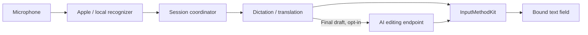

<p align="center">
  
</p>

<h1 align="center">Saylane</h1>

<p align="center">
  <strong>Speak naturally. Write in the language you need.</strong><br />
  A native macOS input method: type Pinyin, hold a key to dictate or translate into the field you are in, and translate what is on your screen. Recognition and translation run on your Mac.
</p>

<p align="center">
  <a href="https://github.com/LiuTianjie/Saylane/releases/latest"></a>
  <a href="project.yml"></a>
  <a href="project.yml"></a>
</p>

<p align="center">
  <a href="https://github.com/LiuTianjie/Saylane/releases/latest">Download</a> ·
  <a href="https://liutianjie.github.io/Saylane/">Website &amp; interactive demo</a> ·
  <a href="docs/安装说明.md">Installation guide</a> ·
  <a href="CHANGELOG.md">Changelog</a> ·
  <a href="#build-from-source">Development</a> ·
  <a href="README.zh-CN.md">简体中文</a>
</p>

<p align="center">
  <br />
  <sub>Hold to speak. Release to commit. Stay in the app you're using.</sub>
</p>

---

## What it does

| | |
| --- | --- |
| **Dictate** | Hold a key and speak. The words appear in the focused field as you say them and are committed when you let go. |
| **Translate as you speak** | Speak one language, write another. Four modes for a language pair, switched with a double tap. |
| **Translate anything on screen** | Select a region in any app; the translation is set where the original stood, in the same size, weight and colour. Web pages, software, pictures, video. |
| **Type** | A full Pinyin input method, backed by Rime, in the same input source. |

With Chinese → English selected:

> **You say:** 把会议改到明天下午三点。<br />
> **You write:** Move the meeting to 3 p.m. tomorrow.

*Illustrative output; wording depends on the recognizer and translation model.*

The default path uses Apple's on-device speech recognition and translation: no account, no model API key. Downloadable local recognizers make the final text more accurate, and AI editing is an optional last step that uses an endpoint you configure.

## Install

You need **macOS 26+ on Apple Silicon**. Intel Macs and older macOS versions are not supported.

Download the `.pkg` and `SHA256SUMS.txt` from [GitHub Releases](https://github.com/LiuTianjie/Saylane/releases/latest). The installer places two programs:

```text
/Library/Input Methods/Saylane.app    the input method: types, and writes text into the field
/Applications/Saylane.app             the main program: dictation, translation, screen translation, settings (no Dock icon)
```

Saylane then adds itself to the input sources and switches to itself; there is no trip to System Settings. One page of setup follows, turning on the four things it needs, once: the input method, the microphone, Accessibility and Screen Recording. Each has one button and ticks itself off; nothing is asked for later, while you are working.

> **Distribution status:** packages published so far are not notarized by Apple, so macOS may refuse to open one directly. The [installation guide](docs/安装说明.md) says what to do; do not turn system protection off. Each release lists its own signing status and checksums.

Upgrading replaces both programs and keeps settings, downloaded models and the Rime user dictionary. To remove Saylane: `sudo bash scripts/uninstall.sh`.

## Use

| Do this | What happens |
| --- | --- |
| Hold **right Option (⌥)** and speak | A small waveform appears and the draft is written in the field as you speak. Release to commit. |
| Press **Esc** while speaking | The dictation is cancelled; nothing is written. |
| Double-tap **right Command (⌘)** | The next language mode: A → A, A → B, B → A, B → B. |
| Press **⌥T** and drag | The selected region is translated in place and pinned on screen. |
| Just type | Pinyin, with candidates. |

All of these keys can be changed in Settings. The talk key starts after it has been held on its own for about 0.3 s; the microphone is already open by then, so the beginning of the sentence is not lost. Pressed together with another key (⌘C, ⌥←, a ⌘-click) it does nothing.

## Dictation

**Live words, then a more accurate final text.** While you speak, the words on screen come from the system recognizer, updated about every 0.26 s and typed out a few characters at a time. With a downloaded model selected, that model writes the final text when you release, about 0.3 s later. If the model fails or is too slow, what the system recognizer heard is written. A long dictation is handed over in stretches that end at sentence boundaries; there is no per-session time limit.

Choose a recognizer in **Settings → Models**. Model weights are not part of the installer; downloads use pinned revisions and SHA-256 verification, with cancel, retry, repair and delete.

| Recognizer | Download | Characters wrong in 100 | How it is used |
| --- | --- | --- | --- |
| **System recognizer · default** | None; language assets are managed by macOS | about 5 | Preview and final text |
| **Qwen3-ASR 0.6B** | 873 MB | about 2 | The system recognizer shows the words live; this model writes the final text |
| **SenseVoiceSmall** | 254 MB | under 4 | Same, smaller |

The error figures come from 150 recordings of real Mandarin speech (FLEURS test set), measured on one Mac with this code. They compare recognizers; they are not a promise about everyday dictation. Method: [speech pipeline notes](docs/SPEECH_PIPELINE.md).

**Written the way it is written.** Numbers come out as digits where both recognizers heard the same number (M1, 36G, 11:35, 0.8.1). Letters said one by one stand together (APP), and common names keep their own spelling (ChatGPT, macOS). A switch decides whether a space stands between Chinese and Latin letters; off, the default, means none anywhere.

**Learns from your corrections.** Change a name or term that came out wrong after a dictation and Saylane remembers the pair: the corrected spelling is offered to the recognizer from then on, and applied directly once you have made the same correction twice. It works where the text was written through the input method and the application lets it read the field back. Pairs are stored on this Mac only and can be forgotten one by one.

**Cleanup and vocabulary.** Fillers and stutters are dropped and spoken self-corrections ("no, I mean …") are applied, on the final text only. A personal vocabulary and an optional glossary of technical terms put names right. Optional AI editing can refine the finished draft through your own Chat Completions-compatible endpoint; it has its own switch and is off by default.

**Where the text goes.** When the focused field has attached an input-method client, text is composed and committed through InputMethodKit, so you see the draft while you speak. Under another input source, or in applications that attach no client (terminals, for instance), the finished text is pasted at the caret and the previous clipboard contents are restored; this route needs the Accessibility permission, and without it the text stays on the clipboard.

## Translation while speaking

Pick a language pair in Settings. A new installation writes what you say, in the language you say it; a double tap of right ⌘ goes round the four modes:

| Mode | With Chinese and English selected |
| --- | --- |
| A → A | Speak Chinese, write Chinese |
| A → B | Speak Chinese, write English |
| B → A | Speak English, write Chinese |
| B → B | Speak English, write English |

Languages: Simplified and Traditional Chinese, English, Japanese, Korean, French, Spanish, German. Translation is Apple's on-device one. English dictation is also useful for self-practice; Saylane transcribes what the model recognizes and does not score pronunciation.

## Translate anything on screen

Press **⌥T**, then select the area to translate (Settings call this feature "Screen translation"). Anything with text on screen can be translated: web pages, application windows, pictures, PDFs, a frame of a video. The pinned result floats above other windows and can be dragged; its Copy button copies the translated picture. Other apps stay usable while it is open.

The translation is set where the original was: size, weight and colour are measured from the pixels of the capture, only the strokes of the original are erased, and background, icons and pictures stay as they are — as if the interface had switched language. On 24 samples with ground truth the median font-size error is 0.9%. Recognition (Vision) and translation (Apple Translation) run locally.

This is a translated view of what was on screen; the underlying application is unchanged. From Chinese to English the translation is longer than the original, so text in buttons and bubbles may be set smaller or wrapped, and interface terms are not always idiomatic. Method, scoring and known gaps: [screen translation V2](docs/SCREEN_TRANSLATE_V2.md).

**Precise translation (optional).** With its switch on, the text of the whole capture goes to your configured AI endpoint in one request, so interface terms are chosen in context, brand names and code stay as they are, and translations are kept short enough for their place. Apple's translation is shown first and replaced when the answer arrives; if none arrives it stays. The request carries the recognized text (with what kind of element each piece looks like and how much fits in its place) and the name of the application; the picture is never sent.

## Pinyin

The Pinyin path is separate from voice: **InputMethodKit → Rime session → librime**, with Saylane's native candidate window. It supports whole-sentence input, composition editing, fuzzy Pinyin with exact matches preferred, mixed English candidates and vocabulary learning. Page keys, `;` `'` picks and Western punctuation are choices in Settings, and an optional 409 MB language model makes whole sentences come out right more often. Details: [Rime Pinyin](docs/RIME_PINYIN.md).

## Privacy and network behavior

Local inference and network access are separate concerns:

| Path | Processing and network use |
| --- | --- |
| Pinyin | Local librime and dictionaries; ordinary typing makes no network requests |
| Speech recognition | Apple on-device recognition or the selected local model; audio is not saved |
| Translation and OCR | Apple Translation and Vision run locally once required language assets are available |
| Learned corrections | Pairs of spellings, stored on this Mac; never sent anywhere, including to the AI endpoint |
| Optional AI editing and precise screen translation | Send text to your configured Chat Completions-compatible endpoint; off by default |
| Optional terminology glossary | Off by default; when on, fetches public category titles from Chinese Wikipedia / Wiktionary once a day, without sending dictation text |
| Downloads | Model weights and language assets, when you ask for them |
| Diagnostics | The latest 500 events per program: times, the application, the step and its duration. No audio, no text |

For AI editing, the request includes the recognized text, languages, draft and applicable vocabulary. It does not include microphone audio or unrelated text from the input field. Remote endpoints require HTTPS; loopback services may use HTTP. API keys are stored in the macOS Keychain, keyed to the endpoint. If editing fails or times out, the ordinary draft is kept.

| Permission or setup step | Purpose |
| --- | --- |
| Input source | Native composition through InputMethodKit; added and selected by Saylane itself |
| Microphone | Records while the talk key is held |
| Accessibility | Makes the talk key work in every application and under every input source; pastes the text where no input-method client is attached |
| Screen Recording | Captures the region selected for screen translation |

All four are turned on from the first-run page and can be reviewed in **Settings → Permissions**.

## Under the hood



The two processes have separate jobs: the input method only types and writes, asks for no permission, and keeps working when the main program quits or crashes; the main program hands previews and final text to it over a local port. See [Architecture](docs/ARCHITECTURE.md).

The coordinator binds each voice session to the application that had the keyboard when it started. Partial results update marked text; the final result commits once. Cancellation and target changes invalidate pending work so late results cannot write into a different session. Local cleanup runs on the final recognition result, before final translation and optional editing.

Pinyin: next-word suggestions and migration of the old custom engine's learning data are not currently supported. The manual dictionary-update check reports differences; it does not install them. [Pinyin architecture](docs/RIME_PINYIN.md).

## Build from source

Development requires **Xcode 26.2+**, XcodeGen, and Python 3.12+ on a supported Mac. For the first MLX build, install Apple's Metal Toolchain:

```bash
xcodebuild -downloadComponent MetalToolchain

git clone https://github.com/LiuTianjie/Saylane.git
cd Saylane
make build
```

`make build` prepares the pinned Rime and native ASR dependencies, generates `Saylane.xcodeproj` from `project.yml`, and builds the Debug app. Initial dependency preparation requires network access. The generated project is not tracked and should not be edited by hand.

| Command | Result |
| --- | --- |
| `make build` | Debug app in `build/Build/Products/Debug/` |
| `make test` | Swift logic tests, native helper checks, and real librime regressions |
| `make release` | Release build without installation |
| `make verify` | Release build, every test, and three self-tests of the built programs (input method, two-process dictation, interface) |
| `make pkg-local` | `dist/Saylane-<version>-<build>-local.pkg` for testing on this Mac (unsigned package) |
| `make pkg` | Release build and `dist/Saylane-<version>.pkg` |

Packaging requires `SAYLANE_SIGNING_IDENTITY` (**Developer ID Application**), `SAYLANE_INSTALLER_IDENTITY` (**Developer ID Installer**), and `SAYLANE_NOTARY_PROFILE` (an existing notarytool profile). The script checks all three before signing, rejects ad-hoc identities, and publishes the final PKG only after notarization and staple verification. App signing, installer signing, notarization, and successful input-source activation are distinct checks.

Build artifacts live in ignored `build/` and `dist/` directories. Building an app does not register it as a working system input method; follow the [installation guide](docs/安装说明.md) for that step.

## Repository and technical notes

| Path | Responsibility |
| --- | --- |
| `Sources/IME/` | The input-method process: InputMethodKit, composition, Rime, candidates |
| `Sources/App/` | The main program's entry point and composition root |
| `Sources/Shared/` | The contract and ports between the two processes |
| `Sources/Input/`, `Sources/Voice/`, `Sources/Screen/` | Gestures, the voice session and its write routes, screen translation |
| `Sources/Services/` | Capture, recognition, translation, models, permissions, input-source installation |
| `Sources/Views/` | Native settings, setup, candidates, and waveform UI |
| `Tests/` | Swift/Python checks and native-runtime regression tests |
| `Vendor/` | ASR integration source, dependency locks, and generated runtime resources |
| `scripts/` | Project generation, dependency preparation, tests, packaging, and uninstall |
| `website/` | Product website and illustrative interactive demo |

| Guide | Covers |
| --- | --- |
| [Architecture](docs/ARCHITECTURE.md) | The two processes, the contract between them, key routing, the voice session, tests |
| [0.3 rewrite design](docs/DESIGN_0.3.md) | Why there are two processes, the protocol and gesture specification, the on-device acceptance list |
| [Changelog](CHANGELOG.md) | User-facing changes per release |
| [Installation](docs/安装说明.md) | Package status, input-source activation, and permissions |
| [Voice input behavior and evaluation](docs/history/VOICE_INPUT_OPTIMIZATION.md) | Live hypotheses, finalization, diagnostics, and reproducible ASR benchmarks |
| [Rime Pinyin](docs/RIME_PINYIN.md) | Candidate behavior, learning, dependency pins, and dictionary licenses |
| [Local recognizers](docs/ASR_COMPARISON.md) | Backend differences and validation limits |
| [Qwen3-ASR](docs/QWEN_ASR.md) | Model manifests, MLX integration, and runtime lifecycle |
| [Speech pipeline](docs/SPEECH_PIPELINE.md) | Live preview, the two-pass final text, written forms, measurements |
| [Screen translation V2](docs/SCREEN_TRANSLATE_V2.md) | Measuring styles from pixels, layout, compositing, scoring and known gaps |
| [Screen translation, earlier design](docs/history/SCREEN_TRANSLATE.md) | Historical rendering notes |
| [Voice design history](docs/history/VOICE_INPUT_V2.md) | Evolving interaction contracts and dated verification records |

Older design documents contain historical plans and handoffs. Use the current source and release notes when evaluating shipped behavior.

<details>
<summary>Why do some identifiers still say RTranslate?</summary>

Saylane was previously named RTranslate. The app, executable, scheme, and new packages use Saylane; selected identifiers remain stable for upgrades:

- `com.rtranslate.*` bundle/input-source IDs and installer receipt IDs.
- Everything Saylane writes now lives under `~/Library/Application Support/Saylane/` (`ASRModels`, `Diagnostics`, `Rime`, `Glossary`). An existing `RTranslate/` directory is moved there on first launch, and is still read from its old place if the move is not possible.
- The Keychain service for the proofreading API key is `com.saylane.final-polish`; keys stored under the old `com.rtranslate.final-polish` name are migrated on first use.
- `RTRANSLATE_SIGNING_IDENTITY` as a compatibility alias for `SAYLANE_SIGNING_IDENTITY`.

The installer recognizes old and new app paths and checks bundle identity before cleanup. Keeping these identifiers preserves continuity; they should not be renamed as a cosmetic change.

</details>

## Contributing

Focused fixes, reproducible bug reports, and documentation improvements are welcome. Include your macOS version, Mac architecture, Saylane version, recognizer, language pair, and target application. Redact private text, audio, screenshots, and endpoint credentials from reports.

Run `make verify` for code changes. Input-method, hotkey, permission, and overlay changes also need testing in the actual macOS session and affected apps. File recognition benchmarks and unit tests do not establish microphone-to-text latency or cross-app compatibility.

`bash scripts/build-ime-test-host.sh` builds `build/tests/IMEIntegrationHost.app`, a native AppKit client with two independent text fields. It selects only already-enabled input sources. Use actual key events to check pinyin composition, switching fields, voice insertion, and cancellation; pasting text or setting an accessibility value does not test the input method. The installed executable also accepts `--microphone-check` for three real capture/stop cycles without saving audio.

## Licensing

The repository currently does not declare a project-wide license. Third-party components and model weights retain their own terms; their licenses do not define a license for Saylane as a whole.

See [third-party notices](Sources/Resources/ThirdPartyNotices.txt), the [vendored ASR license](Vendor/MLXASR/LICENSE), and the [Rime licensing notes](docs/RIME_PINYIN.md#许可材料).
