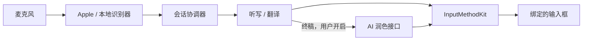

<p align="center">
  
</p>

<h1 align="center">Saylane</h1>

<p align="center">
  <strong>用熟悉的语言说话，写出需要的语言。</strong><br />
  原生 macOS 输入法：打拼音，按住说话把字写进当前输入框，说一种语言写另一种，屏幕上任何画面原地翻译。识别和翻译都在这台 Mac 上完成。
</p>

<p align="center">
  <a href="https://github.com/LiuTianjie/Saylane/releases/latest"></a>
  <a href="project.yml"></a>
  <a href="project.yml"></a>
</p>

<p align="center">
  <a href="https://github.com/LiuTianjie/Saylane/releases/latest">下载</a> ·
  <a href="https://liutianjie.github.io/Saylane/">官网与交互演示</a> ·
  <a href="docs/安装说明.md">安装指南</a> ·
  <a href="CHANGELOG.md">更新记录</a> ·
  <a href="#从源码构建">开发</a> ·
  <a href="README.md">English</a>
</p>

<p align="center">
  <br />
  <sub>按住说话，松开上屏，留在正在使用的应用里。</sub>
</p>

---

## 它做什么

| | |
| --- | --- |
| **听写** | 按住一个键说话，字随着声音出现在当前输入框里，松开时提交。 |
| **边说边译** | 说一种语言，写另一种。一对语言有四种模式，双击切换。 |
| **所见即译** | 框住一块，译文排在原文的位置上，字号、粗细、颜色照原样。网页、软件、图片、视频都行。 |
| **打字** | 完整的拼音输入法，由 Rime 驱动，和语音在同一个输入法里。 |

选择中文 → 英文时：

> **你说：** 把会议改到明天下午三点。<br />
> **写入：** Move the meeting to 3 p.m. tomorrow.

*示例仅用于说明，实际措辞取决于识别器和翻译模型。*

默认使用 Apple 的端侧语音识别和翻译：不用账号，不用模型 API Key。可以下载本地识别模型让终稿更准；AI 润色是可选的最后一步，使用你自己配置的接口。

## 安装

需要 **macOS 26 及以上、Apple 芯片**。不支持 Intel Mac 和更早的系统。

从 [GitHub Releases](https://github.com/LiuTianjie/Saylane/releases/latest) 下载 `.pkg` 和 `SHA256SUMS.txt`。安装器会装两个程序：

```text
/Library/Input Methods/Saylane.app    输入法：打字，把文字写进输入框
/Applications/Saylane.app             主程序：语音、翻译、所见即译、设置（没有 Dock 图标）
```

装完后 Saylane 自己加入输入法列表并切换过去，不用去系统设置。随后是一页引导，把需要的四项一次开好：输入法、麦克风、辅助功能、屏幕录制。每项一个按钮，开好自动打勾；之后使用时不会再弹窗询问。

> **分发状态：** 目前发布的安装包还没有经过 Apple 公证，macOS 可能阻止直接打开。处理办法见[安装指南](docs/安装说明.md)；不要关闭系统的安全保护。每个版本的签名状态和校验文件见它的发布页。

升级会整体替换两个程序，保留设置、已下载的模型和 Rime 用户词库。卸载：`sudo bash scripts/uninstall.sh`。

## 使用

| 操作 | 结果 |
| --- | --- |
| 按住**右 Option（⌥）**说话 | 出现一条声波，草稿随着说话写进输入框。松开提交。 |
| 说话时按 **Esc** | 取消这次听写，什么都不写。 |
| 双击**右 Command（⌘）** | 切到下一种语言模式：A → A、A → B、B → A、B → B。 |
| 按 **⌥T** 并拖动 | 框住的区域原地翻译，结果钉在屏幕上。 |
| 直接打字 | 拼音，带候选。 |

这些按键都可以在设置里改。说话键要单独按住约 0.3 秒才开始；这时麦克风已经在听，句子的开头不会丢。和别的键一起按（⌘C、⌥←、⌘ 点击）不会触发。

## 听写

**实时出字，终稿更准。** 说话时，屏幕上的字由系统识别显示，约每 0.26 秒更新一次，新字逐个放出。选了下载的模型时，松开后由这个模型写终稿，大约 0.3 秒。模型出错或太慢，就写系统识别听到的内容。长听写在句子结尾分段处理，没有单次时长上限。

在**设置 → 模型**里选择识别器。模型权重不在安装包里；下载使用固定版本与 SHA-256 校验，支持取消、重试、修复和删除。

| 识别器 | 下载 | 100 个字错几个 | 怎么用 |
| --- | --- | --- | --- |
| **系统识别 · 默认** | 不用下载，语言资源由 macOS 管理 | 约 5 个 | 预览和终稿都由它出 |
| **Qwen3-ASR 0.6B** | 873 MB | 约 2 个 | 系统识别实时出字，松开后由它写终稿 |
| **SenseVoiceSmall** | 254 MB | 不到 4 个 | 同上，体积小 |

错字数来自 150 段真人普通话录音（FLEURS 测试集），在同一台 Mac 上用这份代码测得；它用来比较识别器，不代表日常听写的绝对水平。测量方法见[语音识别说明](docs/SPEECH_PIPELINE.md)。

**写成该写的样子。** 两个识别器听到同一个数时，数字写成阿拉伯数字（M1、36G、11:35、0.8.1）。一个一个念的字母连在一起（APP），常见名称用它们自己的写法（ChatGPT、macOS）。中文和英文之间加不加空格由一个开关决定；默认关，关就是都不加。

**从你的修改里学。** 听写写入后，把写错的人名、术语改对，Saylane 会记住这一对写法：改后的写法从下一次起提供给识别器，同样的修改做过两次后直接替换。条件是文字通过输入法写入，并且所在应用允许输入法读回输入框。词对只存在这台 Mac 上，可以逐条忘掉。

**口语整理与词库。** 去掉嗯、呃和口吃重复，「不对，我是说……」直接写成改正后的内容，只作用于终稿。个人词库和可选的常见术语表把专有名词写对。可选的 AI 润色通过你自己的 Chat Completions 兼容接口处理写好的草稿；它有独立开关，默认关闭。

**文字写到哪里。** 当前输入框接入了输入法客户端时，文字通过 InputMethodKit 组字和提交，说话时就能看到草稿。当前是其它输入法，或应用没有接入输入法客户端（例如一些终端）时，说完的文字以粘贴方式写到光标处，随后恢复剪贴板原有内容；这条路径需要辅助功能权限，未授权时文字会留在剪贴板。

## 边说边译

在设置里选一对语言。新安装默认写你说的话；双击右 ⌘ 在四种模式之间循环：

| 模式 | 选择中文和英文时 |
| --- | --- |
| A → A | 说中文，写中文 |
| A → B | 说中文，写英文 |
| B → A | 说英文，写中文 |
| B → B | 说英文，写英文 |

支持的语言：简体中文、繁體中文、英语、日语、韩语、法语、西班牙语、德语。翻译用 Apple 的端侧翻译。英文听写也可以用来自己练口语；Saylane 只转写模型听到的内容，不给发音打分。

## 所见即译

按 **⌥T**，框住要翻译的区域。屏幕上有字的地方都能译：网页、软件界面、图片、PDF、视频画面。钉住的结果浮在最上层、可以拖动，它的拷贝按钮复制的是译好的图片；期间其他应用照常可用。

译文写在原文的位置上：字号、粗细、颜色从截图的像素里量出来，只擦掉原文的笔画，背景、图标和图片不动，看起来像把界面的语言换了。在 24 张带真值的样例上，字号误差的中位数是 0.9%。文字识别（Vision）和翻译（Apple Translation）都在本机运行。

结果是画面的翻译视图，不会修改底层应用。中译英时译文比原文长，按钮和气泡里放不下的会缩小或换行，界面用词有时不够地道。做法、评测和已知的不足见[截屏翻译 V2](docs/SCREEN_TRANSLATE_V2.md)。

**精翻（可选）。** 打开开关后，整屏文字一次交给你配置的 AI 接口：按界面语境选词，品牌名和代码保持原样，译文尽量放得进原位置。先显示 Apple 的译图，精翻回来后替换，没回来就保留。请求里是识别出的文字（每段附带它看起来是什么元素、原位置大约放得下多少字）和所在应用的名称；从不发送截图。

## 拼音

拼音走独立路径：**InputMethodKit → Rime Session → librime**，配合 Saylane 原生候选窗。支持整句输入、组字编辑、精确优先的模糊音、中英混合候选和词频学习。翻页键、`;` `'` 选词、中文状态下的英文标点都可以在设置里选；另有一个可选下载的整句语言模型（409 MB），让长句的首选更常是对的。详见 [Rime 拼音](docs/RIME_PINYIN.md)。

## 隐私与网络行为

本地推理与网络访问分别说明：

| 路径 | 处理位置与网络行为 |
| --- | --- |
| 拼音 | 本地 librime 与词库；日常打字不发送网络请求 |
| 语音识别 | Apple 端侧识别或所选本地模型；录音不保存 |
| 翻译与文字识别 | 语言资源就绪后，Apple Translation 与 Vision 在本地运行 |
| 从修改里学到的词 | 只是成对的写法，存在这台 Mac 上；不发往任何地方，包括 AI 接口 |
| 可选的 AI 润色与精翻 | 向你配置的 Chat Completions 兼容接口发送文字；默认关闭 |
| 可选的常见术语表 | 默认关闭；开启后每天从中文 Wikipedia / Wiktionary 获取公共分类标题，不发送听写文本 |
| 下载 | 你主动下载的模型权重和语言资源 |
| 诊断记录 | 每个程序最近 500 条事件：时间、所在应用、步骤和耗时。没有录音，没有文字 |

AI 润色的请求包含识别文字、语言、草稿及适用词表，不包含麦克风音频或输入框中的其他内容。远程接口必须使用 HTTPS，回环地址上的本机服务可使用 HTTP。API Key 按接口地址保存在 macOS Keychain 中。润色失败或超时时保留普通草稿。

| 权限或准备项 | 用途 |
| --- | --- |
| 输入法 | 通过 InputMethodKit 原生组字；由 Saylane 自己添加并选中 |
| 麦克风 | 按住说话键时录音 |
| 辅助功能 | 让说话键在任何应用、任何输入法下都有效；没有输入法客户端时以粘贴方式写入 |
| 屏幕录制 | 截取你框选的那一块画面 |

四项都在首次引导页一次开好，之后可以在**设置 → 权限管理**里查看。

## 工作原理



两个进程分工：输入法进程只做打字和写入，不申请任何权限，也不会因为主程序退出或崩溃而中断；主程序通过本机端口把预览和终稿交给输入法写入。详见[架构](docs/ARCHITECTURE.md)。

协调器将每次语音会话绑定到开始时拥有键盘的应用。中间结果更新 marked text，终稿只提交一次；取消或切换目标会使待处理任务失效，避免晚到结果写入另一轮会话。本地口语整理作用于最终识别结果，之后再执行最终翻译与可选润色。

拼音：当前不支持词后联想，也不会迁移旧自研引擎的学习数据。手动检查词库更新只报告差异，不会安装更新。详见[拼音架构](docs/RIME_PINYIN.md)。

## 从源码构建

需要在受支持的 Mac 上安装 **Xcode 26.2+、XcodeGen 和 Python 3.12+**。首次编译 MLX 前，先安装 Apple Metal Toolchain：

```bash
xcodebuild -downloadComponent MetalToolchain

git clone https://github.com/LiuTianjie/Saylane.git
cd Saylane
make build
```

`make build` 会准备固定版本的 Rime 和原生 ASR 依赖，根据 `project.yml` 生成 `Saylane.xcodeproj`，再构建 Debug 应用。首次准备依赖需要联网。生成的工程不进入 Git，也不应手动修改。

| 命令 | 结果 |
| --- | --- |
| `make build` | Debug 应用，位于 `build/Build/Products/Debug/` |
| `make test` | Swift 逻辑测试、原生辅助进程检查与真实 librime 回归 |
| `make release` | 构建 Release，不安装 |
| `make verify` | Release 构建 + 全部测试 + 三个对已构建程序的自测（输入法、两进程听写、界面） |
| `make pkg-local` | 生成只用于本机测试的 `dist/Saylane-<version>-<build>-local.pkg`（安装包未签名） |
| `make pkg` | 构建 Release 并生成 `dist/Saylane-<version>.pkg` |

打包必须设置 `SAYLANE_SIGNING_IDENTITY`（**Developer ID Application**）、`SAYLANE_INSTALLER_IDENTITY`（**Developer ID Installer**）和 `SAYLANE_NOTARY_PROFILE`（已有的 notarytool 配置）。脚本在签名前检查这三项，拒绝 ad-hoc 签名，并在公证、装订验证通过后才生成最终 PKG。应用签名、安装器签名、公证以及系统输入源成功启用是不同的检查项。

构建结果位于 Git 忽略的 `build/` 和 `dist/`。构建出应用不等于已注册为可用的系统输入法，安装与启用步骤请参阅[安装指南](docs/安装说明.md)。

## 仓库与技术文档

| 路径 | 职责 |
| --- | --- |
| `Sources/IME/` | 输入法进程：InputMethodKit、组字、Rime、候选窗 |
| `Sources/App/` | 主程序入口与组合根 |
| `Sources/Shared/` | 两个进程之间的协议与端口 |
| `Sources/Input/`、`Sources/Voice/`、`Sources/Screen/` | 手势、语音会话与写入路线、所见即译 |
| `Sources/Services/` | 采集、识别、翻译、模型、权限与输入源安装 |
| `Sources/Views/` | 设置、欢迎页和波形 UI |
| `Tests/` | Swift / Python 检查与原生运行时回归 |
| `Vendor/` | ASR 接入源码、依赖锁与生成的运行时资源 |
| `scripts/` | 工程生成、依赖准备、测试、打包与卸载 |
| `website/` | 产品官网与示意性交互演示 |

| 文档 | 内容 |
| --- | --- |
| [架构](docs/ARCHITECTURE.md) | 两个进程、协议、按键路由、语音会话、测试 |
| [0.3 重写设计](docs/DESIGN_0.3.md) | 为什么拆成两个进程、协议与手势规格、真机验收清单 |
| [变更记录](CHANGELOG.md) | 每个版本用户可见的变化 |
| [安装指南](docs/安装说明.md) | 分发状态、输入源启用与权限 |
| [语音体验与评测](docs/history/VOICE_INPUT_OPTIMIZATION.md) | 实时结果、终稿收尾、诊断与可复现的 ASR 评测 |
| [Rime 拼音](docs/RIME_PINYIN.md) | 候选行为、学习、固定依赖与词库许可 |
| [本地识别器](docs/ASR_COMPARISON.md) | 后端差异与验证边界 |
| [Qwen3-ASR](docs/QWEN_ASR.md) | 模型清单、MLX 接入与运行时生命周期 |
| [语音识别说明](docs/SPEECH_PIPELINE.md) | 实时预览、两遍识别的终稿、写法处理、实测数据 |
| [截屏翻译 V2](docs/SCREEN_TRANSLATE_V2.md) | 从像素测量样式、排版、合成、评分和已知不足 |
| [截屏翻译的早期设计](docs/history/SCREEN_TRANSLATE.md) | 历史渲染记录 |
| [语音设计历史](docs/history/VOICE_INPUT_V2.md) | 持续演进的交互契约与分阶段验证记录 |

较早的设计文档包含历史计划和交接记录，判断已发布行为时应以当前源码和版本说明为准。

<details>
<summary>为什么部分标识仍叫 RTranslate？</summary>

Saylane 的旧名称是 RTranslate。应用、可执行文件、Scheme 和新安装包均使用 Saylane；以下标识为了升级兼容而保留：

- `com.rtranslate.*` Bundle / 输入源 ID、Keychain service 与安装器 receipt ID。
- 现在所有数据都放在 `~/Library/Application Support/Saylane/`（`ASRModels`、`Diagnostics`、`Rime`、`Glossary`）。首次启动会把旧的 `RTranslate/` 目录移过来；移动失败时仍会从旧位置读取。
- 润色接口密钥的钥匙串服务名改为 `com.saylane.final-polish`，旧名下的密钥首次使用时自动迁移。
- 独立的 `~/Library/Application Support/Saylane/Rime` 用户词库目录。
- `RTRANSLATE_SIGNING_IDENTITY`，作为 `SAYLANE_SIGNING_IDENTITY` 的兼容别名。

安装器识别新旧应用路径，并在清理前核对 Bundle 身份。这些标识用于保持连续性，不应作为表面改名一起替换。

</details>

## 参与贡献

欢迎提交聚焦的修复、可复现的问题与文档改进。反馈时请提供 macOS 版本、Mac 架构、Saylane 版本、识别模型、语言对和目标应用，并移除日志中的私人文字、录音、截图与接口凭据。

代码改动请运行 `make verify`。输入法、快捷键、权限和覆盖层改动还需在真实 macOS 会话及受影响应用中验证。文件识别评测和单元测试不能证明麦克风到上屏的延迟或跨应用兼容性。

`bash scripts/build-ime-test-host.sh` 会生成 `build/tests/IMEIntegrationHost.app`，提供两个独立的原生 AppKit 输入框，只选择已启用的输入源。用真实按键检查拼音组字、切换输入框、语音上屏和取消；粘贴文字或直接设置辅助功能的值不算输入法测试。已安装的程序还支持 `--microphone-check`，连续执行三次真实采集 / 停止，不保存录音。

## 许可证

仓库目前未声明项目级许可证。第三方组件与模型权重分别遵循自己的条款，这些条款不代表 Saylane 整体的许可证。

详见[第三方声明](Sources/Resources/ThirdPartyNotices.txt)、[内置 ASR 源码许可](Vendor/MLXASR/LICENSE)及 [Rime 许可材料](docs/RIME_PINYIN.md#许可材料)。
