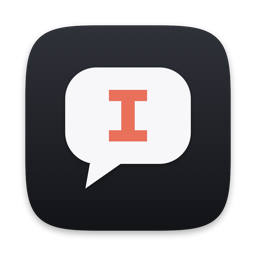
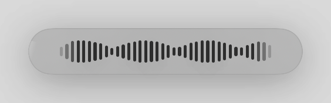
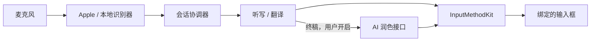

<p align="center">
  
</p>

<h1 align="center">Saylane</h1>

<p align="center">
  <strong>用熟悉的语言说话，写出需要的语言。</strong><br />
  原生 macOS 输入法，将拼音、语音听写和翻译带到当前输入框。
</p>

<p align="center">
  <a href="https://github.com/LiuTianjie/Saylane/releases/latest"></a>
  <a href="project.yml"></a>
  <a href="project.yml"></a>
</p>

<p align="center">
  <a href="https://github.com/LiuTianjie/Saylane/releases/latest">下载</a> ·
  <a href="https://liutianjie.github.io/Saylane/">官网与交互演示</a> ·
  <a href="docs/安装说明.md">安装指南</a> ·
  <a href="#从源码构建">开发</a> ·
  <a href="README.md">English</a>
</p>

<p align="center">
  <br />
  <sub>按住说话，松开上屏，留在正在使用的应用里。</sub>
</p>

---

Saylane 是一个 macOS 系统输入法，加上一个常驻后台的主程序：输入法负责打字和把文字写进输入框，主程序负责听写、翻译、截屏翻译和设置。平时用 Rime 拼音打字，按住快捷键即可听写，也可以用一种语言说话、用另一种语言输出。文字直接在当前输入框中组字，完成后一次提交。

**默认使用 Apple 端侧语音识别与翻译。** 也可以下载其他本地识别模型，或在终稿阶段开启自己配置的 AI 润色服务。普通听写和翻译无需模型 API Key。

例如，选择中文 → 英文：

> **你说：** 把会议改到明天下午三点。<br />
> **输入框里：** Move the meeting to 3 p.m. tomorrow.

*以上为表达方式示例，实际措辞取决于识别与翻译模型。*

## 围绕输入框工作

- **打字和说话共用一个输入法。** Rime 负责拼音组字、候选选择、中英混输和用户词库学习；翻页键、`;` `'` 选词、中文状态下的英文标点都可以在设置里选，另有一个可选下载的整句语言模型（409 MB），让长句的首选更常是对的。语音输入沿用同一套原生文本输入连接。
- **说话时就能看到草稿。** 识别和翻译更新当前组字内容；松开快捷键后收尾并提交一次，`Esc` 取消本次输入。
- **听写与翻译自由切换。** 配置一对语言，在 A → A、A → B、B → A、B → B 之间切换；同语言听写跳过翻译。
- **实时出字，终稿更准。** 说话时的字约每 0.26 秒更新一次；可以下载 Qwen3-ASR，让它在松开后写终稿，错字不到系统识别的一半。
- **中间稿与终稿分别处理。** 本地口语整理、术语修正在终稿阶段执行；可选 AI 润色只处理完成后的草稿，不逐条改写识别预览。
- **也能读懂屏幕上的文字。** 框选屏幕区域，通过本地 Vision OCR 与 Apple Translation，在固定截图上显示译文。

当前输入框接入了输入法客户端时，文字通过 **InputMethodKit** 组字和提交。当前是其它输入法，或应用没有接入输入法客户端（终端、部分 Electron 应用）时，说完的文字以粘贴方式写到光标处，随后恢复剪贴板原有内容；这条路径需要**辅助功能**权限，未授权时文字会留在剪贴板。

## 开始使用

### 1. 安装并启用 Saylane

需要 **macOS 26+ 与 Apple Silicon**。当前构建不支持 Intel Mac 或更早版本的 macOS。

从 [GitHub Releases](https://github.com/LiuTianjie/Saylane/releases/latest) 下载 `.pkg` 和 `SHA256SUMS.txt` 校验文件。安装器会放两个程序：

```text
/Library/Input Methods/Saylane.app    输入法
/Applications/Saylane.app             主程序（0.3 起；没有 Dock 图标，由输入法按需启动）
```

> **分发状态：** [v0.2.75](https://github.com/LiuTianjie/Saylane/releases/tag/v0.2.75) 包内应用具有 Developer ID Application 签名，但 PKG 安装器未签名，也未完成 Apple 公证。当前安装要求请参阅[安装指南](docs/安装说明.md)。

安装结束后 Saylane 会自己加入输入法列表并切换过去，不用去系统设置。随后打开的欢迎页只有一屏：一个试说输入框和三行状态。麦克风在第一次按住说话时由系统询问；辅助功能是可选的。

### 2. 对着输入框说话

1. 聚焦一个受支持的输入框，将输入法切换为 **Saylane**。
2. 确认说话和输出语言。新安装默认说什么写什么（**简体中文听写**）；要翻译，在设置里选方向，或双击右 ⌘ 切换。
3. 按住**右 Option（⌥）**说话。波形胶囊显示录音状态，草稿直接出现在输入框中。
4. 松开完成输入；按 **Esc** 取消当前会话。

按住说话的快捷键可以修改。单独按住约 0.3 秒开始说话，录音在此之前已经打开，不会丢掉句首；和其它键一起按（⌘C、⌥←、⌘ 点击）不会触发。需要在其它输入法下、或光标不在输入框里时也能使用语音，在设置中开启**辅助功能**权限；Saylane 不会切换你当前的输入法。

说话时底部只显示一条波形，文字直接出现在光标处。输入法菜单里的「复制上一次听写」可以取回最近一次的结果。

### 3. 切换语言模式

启用快捷切换后，双击**右 Command（⌘）**，可循环切换所选语言对的四种模式：

| 模式 | 以中文和英文为例 |
| --- | --- |
| A → A | 说中文，写中文 |
| A → B | 说中文，写英文 |
| B → A | 说英文，写中文 |
| B → B | 说英文，写英文 |

英文听写也可以辅助自我练习。Saylane 显示模型识别到的内容，不提供发音评分。

## 语音识别模型

在**设置 → 模型**里选择；语音输入页也有“识别模型”一行可以点过去。下载完成后自动启用。模型权重不在安装包里。

| 识别器 | 下载 | 100 个字错几个 | 怎么用 |
| --- | --- | --- | --- |
| **系统识别 · 默认** | 不用下载，语言资源由 macOS 管理 | 约 5 个 | 预览和终稿都由它出 |
| **Qwen3-ASR 0.6B** | 873 MB | 约 2 个 | 系统识别实时出字，松开后由它写终稿（约 0.3 秒） |
| **SenseVoiceSmall** | 254 MB | 不到 4 个 | 同上，体积小 |

错字数来自 150 段真人普通话录音（FLEURS 测试集），在同一台 Mac 上用这份代码测得；它用来比较识别器，不代表日常听写的绝对水平。测量方法和与豆包输入法的对比见[语音识别说明](docs/SPEECH_PIPELINE.md)。

说话时屏幕上的字总是由系统识别实时显示，约每 0.26 秒更新一次，新字逐个放出。选了下载的模型时，终稿由模型来写；它出错或太慢，就写系统识别听到的。长听写会在句子结尾分段处理，没有单次时长上限。下载使用固定版本与 SHA-256 校验，支持取消、重试、修复和删除。

AI 润色的语音输入开关独立控制；若希望文字不发送到润色接口，需要将它关闭。个人热词可以引导受支持的识别路径，但不能保证某个词一定识别正确。详见[本地模型说明](docs/ASR_COMPARISON.md)与 [Qwen 接入](docs/QWEN_ASR.md)。

## 截屏翻译

按 **⌥T**（可在设置中修改，录制时会检查是否与系统快捷键冲突）进入框选，再选择需要翻译的区域。钉住的结果浮在最上层、可以拖动，期间其他应用照常可用。应用固定截取的画面，使用 Vision OCR 与 Apple Translation 将译文覆盖到相应文字区域。此功能需要屏幕录制权限。

结果是截图的翻译视图，不会修改底层应用。密集排版、小字和复杂背景会影响 OCR 与译文位置。[截屏翻译说明](docs/history/SCREEN_TRANSLATE.md)与[场景验证记录](docs/history/SCREEN_TRANSLATE_SCENARIOS.md)记录了实现方式及尚存的视觉限制。

可选的截屏润色有独立开关，使用已配置的 AI 接口，可能发送识别文字、译文草稿和邻近识别上下文，默认关闭。

## 隐私与网络行为

本地推理与网络访问分别说明：

| 路径 | 处理位置与网络行为 |
| --- | --- |
| 拼音 | 本地 librime 与词库；日常打字不发送网络请求 |
| 语音识别 | Apple 端侧识别或所选本地模型；所需资源可能需要下载 |
| 翻译与 OCR | 语言资源就绪后，Apple Translation 与 Vision 在本地运行 |
| 可选 AI 润色 | 向用户配置的 Chat Completions 兼容接口发送文字；默认关闭 |
| 常见术语词库 | 默认关闭；开启后定期从中文 Wikipedia / Wiktionary 获取公共分类词条，不发送听写文本 |
| 日常诊断 | 会话耗时与状态元数据，不包含录音或转写正文 |

语音润色请求包含识别文字、语言、草稿及适用词表，不包含麦克风音频或输入框中的其他内容。远程润色地址必须使用 HTTPS，回环地址上的本机服务可使用 HTTP。API Key 按接口地址保存在 macOS Keychain 中。

语音润色失败或超时时会保留普通草稿；取消会话会使在途任务与晚到结果失效。文件式 ASR 评测报告与日常诊断不同：为了评估准确率，评测报告会明确保存转写正文。

<details>
<summary>需要哪些 macOS 权限？</summary>

| 权限或准备项 | 用途 |
| --- | --- |
| 启用输入法 | 允许通过 InputMethodKit 进行原生组字 |
| 麦克风 | 采集按住说话时的录音 |
| 语音识别 | 使用 Apple 识别时需要；在设置的权限页管理 |
| 辅助功能（推荐） | 在任何应用、任何输入法下使用快捷键；没有输入法客户端时以粘贴方式写入 |
| 屏幕录制 | 捕获用户选择的截屏翻译区域 |

缺失权限可在**设置 → 权限管理**中查看和补齐。模型与语言是否就绪会单独检查，不与系统权限混为一谈。

</details>

## 工作原理



两个进程分工：输入法进程只做打字和写入，不申请任何权限，也不会因为主程序退出或崩溃而中断；主程序通过本机端口把预览和终稿交给输入法写入。详见[架构](docs/ARCHITECTURE.md)。

协调器将每次语音会话绑定到开始时拥有键盘的应用。中间结果更新 marked text，终稿只提交一次；取消或切换目标会使待处理任务失效，避免晚到结果写入另一轮会话。本地口语整理作用于最终识别结果，之后再执行最终翻译与可选润色。

拼音走独立路径：**InputMethodKit → Rime Session → librime**，配合 Saylane 原生候选窗，支持组字编辑、精确优先的模糊音、中英混合候选及原生词频学习。当前不支持词后联想，也不会迁移旧自研引擎的学习数据。手动检查词库更新只报告差异，不会安装更新。详见[拼音架构](docs/RIME_PINYIN.md)。

## 从源码构建

需要在受支持的 Mac 上安装 **Xcode 26.2+、XcodeGen 和 Python 3.12+**。首次编译 MLX 前，先安装 Apple Metal Toolchain：

```bash
xcodebuild -downloadComponent MetalToolchain

git clone https://github.com/LiuTianjie/Saylane.git
cd Saylane
make build
```

`make build` 会准备固定版本的 Rime 和原生 ASR 依赖，根据 `project.yml` 生成 `Saylane.xcodeproj`，再构建 Debug 应用。首次准备依赖需要联网。生成的工程不进入 Git，也不应手动修改。

| 命令 | 结果 |
| --- | --- |
| `make build` | Debug 应用，位于 `build/Build/Products/Debug/` |
| `make test` | Swift 逻辑测试、原生辅助进程检查与真实 librime 回归 |
| `make release` | 构建 Release，不安装 |
| `make verify` | Release 构建 + 全部测试 + 三个对已构建程序的自测（输入法、两进程听写、界面） |
| `make pkg-local` | 生成只用于本机测试的 `dist/Saylane-<version>-<build>-local.pkg`（安装包未签名） |
| `make pkg` | 构建 Release 并生成 `dist/Saylane-<version>.pkg` |

打包必须设置 `SAYLANE_SIGNING_IDENTITY`（**Developer ID Application**）、`SAYLANE_INSTALLER_IDENTITY`（**Developer ID Installer**）和 `SAYLANE_NOTARY_PROFILE`（已有的 notarytool 配置）。脚本在签名前检查这三项，拒绝 ad-hoc 签名，并在公证、装订验证通过后才生成最终 PKG。应用签名、安装器签名、公证以及系统输入源成功启用是不同的检查项。

构建结果位于 Git 忽略的 `build/` 和 `dist/`。构建出应用不等于已注册为可用的系统输入法，安装与启用步骤请参阅[安装指南](docs/安装说明.md)。

## 仓库与技术文档

| 路径 | 职责 |
| --- | --- |
| `Sources/IME/` | 输入法进程：InputMethodKit、组字、Rime、候选窗 |
| `Sources/App/` | 主程序入口与组合根 |
| `Sources/Shared/` | 两个进程之间的协议与端口 |
| `Sources/Input/`、`Sources/Voice/`、`Sources/Screen/` | 手势、语音会话与写入路线、截屏翻译 |
| `Sources/Services/` | 采集、识别、翻译、模型、权限与输入源安装 |
| `Sources/Views/` | 设置、欢迎页和波形 UI |
| `Tests/` | Swift / Python 检查与原生运行时回归 |
| `Vendor/` | ASR 接入源码、依赖锁与生成的运行时资源 |
| `scripts/` | 工程生成、依赖准备、测试、打包与卸载 |
| `website/` | 产品官网与示意性交互演示 |

| 文档 | 内容 |
| --- | --- |
| [架构](docs/ARCHITECTURE.md) | 两个进程、协议、按键路由、语音会话、测试 |
| [0.3 重写设计](docs/DESIGN_0.3.md) | 为什么拆成两个进程、协议与手势规格、真机验收清单 |
| [变更记录](CHANGELOG.md) | 每个版本用户可见的变化 |
| [安装指南](docs/安装说明.md) | 分发状态、输入源启用与权限 |
| [语音体验与评测](docs/history/VOICE_INPUT_OPTIMIZATION.md) | 实时结果、终稿收尾、诊断与可复现的 ASR 评测 |
| [Rime 拼音](docs/RIME_PINYIN.md) | 候选行为、学习、固定依赖与词库许可 |
| [本地识别器](docs/ASR_COMPARISON.md) | 后端差异与验证边界 |
| [Qwen3-ASR](docs/QWEN_ASR.md) | 模型清单、MLX 接入与运行时生命周期 |
| [截屏翻译](docs/history/SCREEN_TRANSLATE.md) | 渲染行为与后续实现记录 |
| [语音设计历史](docs/history/VOICE_INPUT_V2.md) | 持续演进的交互契约与分阶段验证记录 |

较早的设计文档包含历史计划和交接记录，判断已发布行为时应以当前源码和版本说明为准。

<details>
<summary>为什么部分标识仍叫 RTranslate？</summary>

Saylane 的旧名称是 RTranslate。应用、可执行文件、Scheme 和新安装包均使用 Saylane；以下标识为了升级兼容而保留：

- `com.rtranslate.*` Bundle / 输入源 ID、Keychain service 与安装器 receipt ID。
- 现在所有数据都放在 `~/Library/Application Support/Saylane/`（`ASRModels`、`Diagnostics`、`Rime`、`Glossary`）。首次启动会把旧的 `RTranslate/` 目录移过来；移动失败时仍会从旧位置读取。
- 润色接口密钥的钥匙串服务名改为 `com.saylane.final-polish`，旧名下的密钥首次使用时自动迁移。
- 独立的 `~/Library/Application Support/Saylane/Rime` 用户词库目录。
- `RTRANSLATE_SIGNING_IDENTITY`，作为 `SAYLANE_SIGNING_IDENTITY` 的兼容别名。

安装器识别新旧应用路径，并在清理前核对 Bundle 身份。这些标识用于保持连续性，不应作为表面改名一起替换。

</details>

## 参与贡献

欢迎提交聚焦的修复、可复现的问题与文档改进。反馈时请提供 macOS 版本、Mac 架构、Saylane 版本、识别模型、语言对和目标应用，并移除日志中的私人文字、录音、截图与接口凭据。

代码改动请运行 `make verify`。输入法、快捷键、权限和覆盖层改动还需在真实 macOS 会话及受影响应用中验证。文件识别评测和单元测试不能证明麦克风到上屏的延迟或跨应用兼容性。

`bash scripts/build-ime-test-host.sh` 会生成 `build/tests/IMEIntegrationHost.app`，提供两个独立的原生 AppKit 输入框，只选择已启用的输入源。用真实按键检查拼音组字、切换输入框、语音上屏和取消；粘贴文字或直接设置辅助功能的值不算输入法测试。已安装的程序还支持 `--microphone-check`，连续执行三次真实采集 / 停止，不保存录音。

## 许可证

仓库目前未声明项目级许可证。第三方组件与模型权重分别遵循自己的条款，这些条款不代表 Saylane 整体的许可证。

详见[第三方声明](Sources/Resources/ThirdPartyNotices.txt)、[内置 ASR 源码许可](Vendor/MLXASR/LICENSE)及 [Rime 许可材料](docs/RIME_PINYIN.md#许可材料)。
